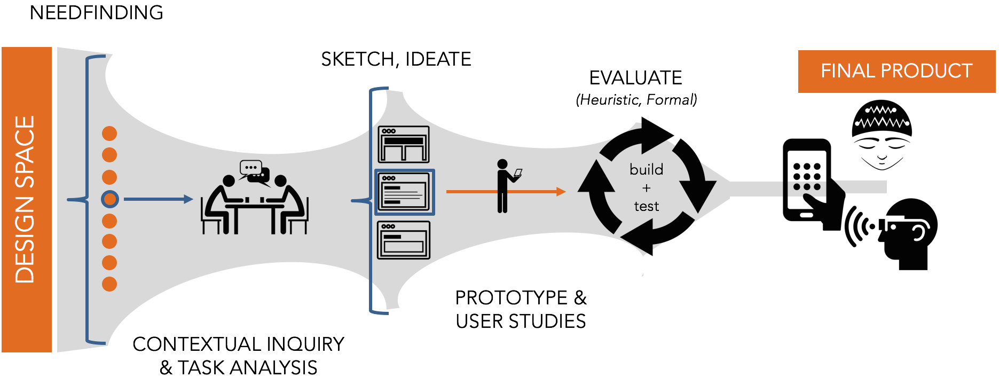

---

layout: course
title: Documenting Your Design Process
course: CSC 363 HCI
description: for CSC 363 - Human Computer Interaction
permalink: /teaching/hci/design-doc
course-url: /teaching/hci
---
# Building the Content of a Design Doc

At the conclusion of each design sprint, you and your team will construct a public-facing document that presents your process and outcome. You will be assessed using the [Design Rubric](https://docs.google.com/spreadsheets/d/1aI9LcmVZmh_977G__U4Guz_rPRCwWZs26J_yHXbhSyY/edit?usp=sharing) (or a variation of it). This will consist of:

1. A **post on Medium**. The post can either be self-published or shared as a draft with me. With your permission, I am hoping to share stand-out work from each assignment and make them public on the course homepage.
2. Embedded in your post, a **demo video** that shows interaction with your techonology, highlighting the key design decisions
that you made. This will likely require you uploading your video to a public service (e.g., YouTube). *Note: some of your assingments may NOT require a video. Read the instructions carefully.*

*Image courtesy of Emily Wall (Emory).*

## Why do I have to do this?

Motivation courtesy of [Evan Peck](https://evanpeck.github.io/): *In May 2017, I sat down with a design researcher from Google to talk about what they look for in job applicants. She was frustrated with the applications being sent their way - “I just see images of the final product! I don’t have any understanding of the process they used to get there. What did they do?”*

*Introducing new technology at the scale of Google (millions of people) is a risky proposition. Small misconceptions can go wrong very quickly. In that environment, it is critical to not only create a good product, but be able to articulate the decisions you made along the way.*

*This requirement is to make my Google friends happy - you will be creating public-facing design documents that accompany each of your design sprints. If you do it well, these documents are invaluable to future employees to understand the kind of employee that they will potentially hire. More importantly, it forces you to justify your own decisions within the context of people - not just program functionality.*

## What should be in my design reflection?

**Start with a one-paragraph summary.** This should highlight what your design objectives were and what you created. If someone refuses to read a word of your post beyond this first paragraph, they should still have the gist of what you tried to create.

**The majority of your post should clearly walk through and reflect on the design stages that you went through to arrive at the final prototype.** At each stage, include some form of evidence - a video/photo of you testing your app with users, photos of the sketches you made to brainstorm your app context, a gif of some interaction you were testing out… anything!

By the conclusion of your post, you should have broadly addressed the following questions:

* What worked? What didn’t work?
* What options did you explore?
* How did you test those options?
* How did you decide on the results?
* What was the final result?
* Looking at your final prototype, what are its strengths? What are its weaknesses? What would be improved upon if you had more time?

These kind of questions are frequently cited as the critical pieces that companies want to see. In some assignments, I will explicitly ask you to focus on one step of the design process. In that case, you should shift the focus accordingly.

For a more concrete example, this can serve as an target for what you should shoot for (although it is longer than what you need): [Designing Facebook Collage](https://medium.com/designatmeta/designing-facebook-collage-304436764ca8).

You should have a conclusion paragraph. This wraps up and summarizes your post.

## What does a good post consist of?

Writing a good post for a broad audience is *not* the same as writing a reflection or paper for a class at Davidson. Carefully reflect on the content, language, and visual design of your post.

**Visually, what does a *good* post look like?** Visit some blogs and scroll through the posts without even reading the content. Despite a lack of content, you are already making judgments about whether this wall of text is worth reading. How are you making these judgments? What is it based on?
* [Quick tips](https://www.integritive.com/non-writers-guide-writing-web/) on writing a good post

Some examples of blog posts that I believe do a nice job discussing the design process:

* [How to design a robust chatbot interaction](https://uxdesign.cc/how-to-design-a-robust-chatbot-interaction-8bb6dfae34fb): While this is significantly longer than your reflections need to be, notice the pacing of the article - subheadings, links, lists, quotes, images, etc.
* [Our Product Design Process](https://medium.com/@Asis_Patel/our-product-design-process-9329cb3bc403): This post is image heavy, but notice how it sections a potentially long document into easily digestible chunks.
* [Peek Inside a Facebook Design Critique](https://medium.com/designatmeta/peek-inside-a-facebook-design-critique-c4833efda26e): While most of the content of this post is a long conversation, notice how the visual design keeps it interesting. The pacing is broken up by example images and quotes, followed by a nice summative reflection at the conclusion.

In each of the previous posts, consider how there is never a long block of text. They are transformed into shorter, punchier paragraphs. Also notices how you never see a long string of paragraphs back-to-back. They are always broken up by subheadings, lists, or images to help readers visually parse through the information. **Your posts should do the same.** There is no reason why your work shouldn’t look as professional in presentation as the ones above.

All of that is to say: **your post should be *skimmable*.** For my sake, for recruiters' sake, for the sake of best practices in writing for the masses -- that means you will want to have clear sectioning to outline your design process. What those headers are depends on how you want to tell the story of your design. You may also want to *sparingly* consider other ways of drawing attention to critical points in your design process such as **bold** or *italic* formatting for critical points. Careful not to overdo it though -- too much and it will lose its efficacy in drawing attention to the things that matter (if everything appears important, then nothing appears important).

> **Tips for the process:**
Document, document, document! Take pictures, record audio, and make videos every step of the way. Make a record of everything from early ideas all the way to final prototypes. These will be critical for writing your design documents. Note that many of these assignments (from a technical perspective) could be tackled individually. Part of the reason that I am forming teams is to increase the number of perspectives each group has to spend on reflections like this.

While the post should be a group initiative, it is useful to identify someone in your team to **document your design process ALONG THE WAY** and begin writing the framework of your post. The important bit here is that you are considering your reflection through the entire design process, *not* just at the end.

## Demo Video

The interactions that you build will break over time, but demo videos last forever. In that spirit, somewhere in your design post, you should have a demo video that that demonstrates the core interactions of your interface. By the end of the video, it should be clear what the primary functions of your app are. **In most cases, these videos should last no more than 1 minute.**

### What makes a *good* video?

Good videos have good visuals and good sound. The advice is obvious, but inevitably there will be submissions every year with 
blurry input and the soundscape of a wind tunnel. We are trying to avoid this.

Decide whether you want to use music, captions, narrative, or some kind of combination of them. Don't create a silent demo video. 
Below, you'll find some nice resources for music that you can include as a backdrop to your product.
* [How to Create Your First Product Demo Video as a Total Newbie](https://www.process.st/product-demo-video/): You might not necessarily use the same tech in the article, but many of the principles remain.

#### Good Examples:
* [Clear for iPhone](https://www.youtube.com/watch?v=S00H-rz7fGo)
* [Orchestra unveils Mailbox](https://www.youtube.com/watch?v=_Us1Ws4i14c)
* [Facebook Messenger Chat with Bot Demo](https://www.youtube.com/watch?v=_Kk3AbP3SI0)

Somewhere in your design post, a demo video should be embedded that shows interaction with your final project. You will likely need to upload your demo video to YouTube or Vimeo. 

#### Multimedia for your videos
Since our intention is to be able to broadly share these videos, it is important that we take into account copyright considerations. Fortunately, Davidson's Library has prepared guides that link to resources that should provide you with a vast library of sound, video, and images to accompany your videos and make them look as professional as possible.

* [Public Domain usage and content](https://davidson.libguides.com/c.php?g=796909&p=5699936)
* [Adding music](https://davidson.libanswers.com/copyright/faq/214851)
* [Using video clips that aren't your own](https://davidson.libanswers.com/copyright/faq/214853)

#### Recording your videos
Your video should be as high quality as possible. For many of your screen-based products, you’ll want some kind of screen-capturing software.

* On Mac: QuickTime has built-in screen capture software that will record any activity on the screen. The shortcut to start recording is to press Cmd (command) + Shift + 5 simultaneously.  There are other options, but this is likely the most simple.
* On Windows: There are a number of free options on Windows - many of which can be explored in [this article](https://www.techradar.com/news/the-best-free-screen-recorder).
* Davidson Digital Learning has additional ideas in [this article](https://digitallearning.davidson.edu/screencapture/).

#### Video editors
You’ll also need a decent video editor to put together sight and sound.

* On Mac: iMovie is probably your best bet. It provides a very easy drag-and-drop interface to import music, videos, and images, as well as create basic annotations (titles). We have iMovie in labs and classrooms on campus (see [T&I article](https://support.ti.davidson.edu/hc/en-us/articles/1500007177241-iMovie)).
* On Windows: Windows MovieMaker (Video Editor) is a popular choice that often comes pre-installed on Windows machines.

# How will I be assessed?
You will be assessed in 3 different ways:
1. Most significantly, you will be assessed by me using the [design document rubric](https://docs.google.com/spreadsheets/d/1aI9LcmVZmh_977G__U4Guz_rPRCwWZs26J_yHXbhSyY/edit?usp=sharing). Please read through this carefully! Note that functionality is actually a small portion of your grade. *Documentation and reflection of your design process is weighted heavily*. You will receive feedback either through a variant of this rubric linked in Moodle, or we will discuss it in-person with your group during class.

2. [Peer feedback](https://forms.gle/4TgYVtRABUdqjeZX7): In addition, a large part of your grade (typically 15-25%) will depend on [peer feedback](https://forms.gle/4TgYVtRABUdqjeZX7). That means if you let your team down and don't contribute your part, your grade will be affected.
3. Finally, during the in-class demos, you will share feedback on the demos that the other groups present using the [I Like, I Wish, What If](https://www.thirdway.org/thinking-tool/i-like-i-wish-what-if) framework. I will note who participates during class.