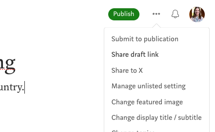

---

layout: course
course: CSC 363 HCI
course-url: /teaching/hci
title: Homework 2
description: Needfinding
permalink: /teaching/hci/assignments/hw2
---

# Needfinding

* Group size: Individual
* Assignment opens: Monday, September 1
* Due: Monday, September 8, *by 11:55 PM*. 

## Overview 
In this assignment you will plan, develop, and execute a round of needfinding. You will present your interview plan (methodology), data gathered from your initial interviews, and the key insights and inferences you have made in a **private draft of a Medium post** submission. You will capture this analysis in an [empathy map](https://www.nngroup.com/articles/empathy-mapping/). **BE SURE TO READ THE SECTION ON [ANONYMITY](#anonymity)**.

## Choose Your Problem
In this assignment, you will choose an existing aspect of the user experience related to personal health data and endeavour to understand the needs of users. This could include, e.g.:

* Tracking fitness goals
* Use of biosensors e.g., for blood sugar monitoring
* Making a therapy appointment
* Obtaining medical imaging data
* Getting and paying an itemized bill
* Following up after an appointment
* ...

**Choose wisely.** You will be prototyping solutions for this same problem context in the next assignment.

## Requirements

1. Make a plan to interview *at least 3 people* related to your problem. The interviewees should be end users and can include up to one domain expert, as needed. The interviews can vary from short interviews, e.g., 20 minutes to long interviews, e.g., 60 minutes. Interviews can take place in-person or by Zoom.

2. Shape your plan.
* Determine what your domain of interest is (describe it as well as you can & include pictures in the final report that help to illustrate it).
* Who will you interview, why did you choose them, where and when will the interview take place.
* What questions will you ask? Try to outline areas of inquiry you intend to probe. Make sure to plan some questions and *focus on “why” and “feelings.”*

3. Get out and interview.
* Interview *no more than one Davidson student* - try to get participants from off campus and also avoid interviewing close family members!
* You should get your interviewees to sign a [consent form](/forms/consent_form_for_class.pdf) ensuring their confidentiality (copy the document and modify to use it).
* Record what, how, and why they are doing what they are doing.
* Remember these interviewing tips in the types of things to look for and how to ask. Get stories! Refer back to our lecture notes!
* Remember, your questions are just a guide to get you comfortable starting. Veer & pull strings to get to interesting stories and emotions.

4. Unpack the needfinding data by using the [empathy map method](https://www.nngroup.com/articles/empathy-mapping/) and identify surprises, contradictions, and tensions. We recommend you have at minimum one empathy map for your most interesting interview. This will be valuable in the next assignment in making sense of your user’s point of view, brainstorming “how might we’s” and in building experience prototypes.

## Finding Interview Participants
* **If it's safe to do so where you live,** recruit people at public places (e.g., coffee shops in a downtown area). If you ask respectfully and use your judgement, many people you approach will be willing to give you their time.
* Nextdoor.com. **Get started with this early** because there is a screening process to verify you actually live in the neighborhood you’re posting for.
* Social media posts. To get past second-degree connections, you can post on Facebook or other social media sites and encourage people to share with relevant connections (this is known as snowball sampling! -- you can also ask earlier participants if they can pass your ad on to others they know).
* Reddit. The subreddit [https://www.reddit.com/r/SampleSize/](https://www.reddit.com/r/SampleSize/) is dedicated to recruiting people for research studies or polls. This can be a good way to reach a more diverse group of people.

## Anonymity
Your participants do not want their interviews shared with the world. This is specified in the consent form:
> I understand that the researcher will not identify me by name in any reports using information obtained from this interview and that my confidentiality as a participant in this study will remain secure. Subsequent uses of records and data will be subject to standard data use policies which protect the anonymity of individuals and institutions. 

This means **you should not use any names or recognizable information in your report.** For example, if you interview your dad about how he schedules doctors appointments, you should *not* say, "My dad John Williams often calls his podiatrist to schedule appointments." You can write instead, "Participant 1 (P1) often calls his podiatrist to schedule appointments. P1 is in his mid-50s and has had recurring foot problems, so he often visits the podiatrist." This second version preserves his anonymity.

An example of removing a name, *but keeping recognizable information* (bad!), is in cases when the information allows someone to be discovered. For example, "Participant 1 is a former Davidson College student who played basketball and now plays professionally in the NBA." Even though there is no name in the sentence, someone can deduce who this sentence is about.

To further protect their anonymity, you will keep your Medium blog post as a draft. We will publish later homework and design sprints, so I want you to get familiar with writing blog-style posts and with Medium's interface. However, we do not want to publish this work, since that would require a higher level of consent form. *To send Dr. Williams your draft link, click the triple dots in the upper right corner and select "Share draft link".*

 

## Deliverables
An example from the Hall of Fame is [here](https://medium.com/@meideng06/needfinding-tracking-and-maintaining-fitness-goals-f7bb66f9158a). 

1. The output from this assignment should be the [design document](/teaching/hci/design-doc). Submit the link of the Medium **draft** post along with your name on Moodle. Also include signed consent forms in your Moodle submission (but **do not include these in the blog post!**). As with all design documents, it should include evidence of your design process. **You do NOT need to create a demo video for this design module.** For this assignment, I would expect a minimum of the following:
* Introduction/motivation for the problem context you chose.
* Needfinding methodology (include images). Make sure you say who your participants were, why they were chosen, how they were recruited, and where they were interviewed (include images). What did you ask?
* Interview results and analysis. Pictures and quotes. Empathy map with highlighted components of what you found important/interesting. Discuss tensions, contradictions, surprises in the interview. Inferences, conclusions, or questions you might have about your results. Initial assessment of “needs” and “insights”. You should *not* include complete transcripts of the interviews.

### Grading
Grading will be based on a *[variation](https://docs.google.com/spreadsheets/d/1_i_fwuccu8wWfdvdZCl6GJnptnv65l_dw0ZcPbcuQR0/edit?usp=sharing)* of the [design rubric](https://docs.google.com/spreadsheets/d/1aI9LcmVZmh_977G__U4Guz_rPRCwWZs26J_yHXbhSyY/edit?usp=sharing).