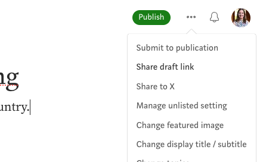

---

layout: course
course: CSC 363 HCI
course-url: /teaching/hci
title: Homework 2
description: Needfinding
permalink: /teaching/hci/assignments/hw2
---

# Needfinding

* Group size: Individual
* **AI Policy**: {{ site.ai-yellow }}
* Assignment opens: Monday, September 1
* Due: Monday, September 8, *by 11:55 PM*. 

## Overview 
**Purpose**: In this assignment you will plan, develop, and execute a round of *needfinding*, the foundational qualitative research process in HCI where designers uncover latent user needs, emotional drivers, and pain points before building solutions. 

You will present your interview plan (methodology), data gathered from your initial interviews, and the key insights and inferences you have made in a **Google Doc** submission. You will capture this analysis in an [empathy map](https://www.nngroup.com/articles/empathy-mapping/). **BE SURE TO READ THE SECTION ON [ANONYMITY](#anonymity)**.

**Why this matters (this week and beyond)**: ⚠️ Choose your problem domain wisely! You will use the user insights, empathy maps, and problem context gathered in this assignment to prototype solutions in Homework 3. Beyond this class, learning how to structure, conduct, and analyze interviews can help you host meetings with your boss, ask coworkers for help, and listen to clients/stakeholders when they hire you for a project.

### What you will learn & practice:
* Qualitative Fieldwork & Interviewing: You will design and execute semi-structured interviews that push beyond surface-level answers to uncover user motivations, emotional reactions, and lived experiences.

* Ethics & Anonymity in HCI Research: You will practice recruiting participants ethically, obtaining informed consent, and protecting participant confidentiality when reporting research data.

* Sensemaking & Synthesis: You will apply empathy mapping to organize raw qualitative data, identify core contradictions, tensions, and surprises, and distill insights that directly feed into user-centered product design.

## Task
Follow these step-by-step instructions to plan, conduct, and analyze your needfinding research:

### Step 1: Select Your Problem Domain
Choose an existing aspect of the user experience related to personal health data and endeavour to understand the needs of users. Examples include:

* Tracking fitness goals
* Use of biosensors e.g., for blood sugar monitoring
* Finding and scheduling a therapy appointment
* Accessing and managing medical imaging data
* Understanding and paying an itemized bill
* Post-appointment care and follow-up routine
* ... and more! 

### Step 2: Formulate your Interview Plan

**Recruitment target**: plan to interview *at least 3 people*:
    * Up to 1 participant can be a domain expert (e.g., a nurse, personal trainer, billing specialist).
    * The rest must be end users (i.e., people who only use the technology, they don't participate in any aspect of development or have expert knowledge of the domain)
    * **Restrictions**: Interview **no more than 1 Davidson student**. Avoid close family members. 

**Recruitment strategies**: Start early! Use public spaces (coffee shops), Nextdoor, social media snowballing, or subreddits like r/SampleSize. 

**Interview Planning**: Before you contact anyone, determine what your domain of interest is (describe it as well as you can & include pictures in the final report that help to illustrate it). This will help you narrow the scope of your discussion and problem, and will make it easier to articulate to your interviewees.

Then be sure to write down:
* Who will you interview, why did you choose them, where and when will the interview take place.
* What questions will you ask? Try to outline areas of inquiry you intend to probe. You should plan for **20-60 minute interviews**.
* Make sure to plan some questions and *focus on “why” and “feelings”* to elicit stories. Avoid questions that can be answered with a simple yes/no -- these can lead to conversational deadends.

### Step 3: Conduct the Interviews & Manage Consent

**Consent First**: Before starting the interview, have each participant read and sign the [Class Consent Form](/forms/consent_form_for_class.pdf) (download, adapt, and sign or e-sign).

**Execute**: Interviews can be in-person or via Zoom (20–60 minutes long).

**Interview Dynamic**: Use your questions as a guide, but follow interesting tangents. Pull strings to uncover emotional reactions, workarounds, and underlying motivations.

### Step 4: Protect Participant Anonymity

You must strictly protect your participants' identities in your write-up:

* *No Real Names*: Refer to subjects as "Participant 1 (P1)", "P2", etc.

* *Strip Distinguishing Details*: Omit unique identifiers that allow someone to deduce identity (e.g., "former Davidson basketball player now in the NBA").

### Step 5: Synthesize with an Empathy Map

Unpack your research using the [NN/g Empathy Mapping Method]((https://www.nngroup.com/articles/empathy-mapping/)).

* Create at least 1 full empathy map for your most insightful interview. This empathy map will be valuable in the next assignment in making sense of your user’s point of view, brainstorming “how might we’s” and in building experience prototypes. 
    * **Optional**: If you feel like another interview was critical to capture all of the complexities of the problem, then make an additional map for this interview (you will not get extra points for making a second map -- the decision is up to you and how you plan on telling your story). 

* Highlight key surprises, contradictions, and tensions (e.g., when what a user says contradicts what they do).

### Step 6: Complete Your Write-Up & Submit
Draft your write-up following the structure of the CSC 363 Design Document (see an [example](https://medium.com/@meideng06/needfinding-tracking-and-maintaining-fitness-goals-f7bb66f9158a) in the Hall of Fame).

You can use similar headers and features in Google Docs by using [Markdown in Google Docs](https://support.google.com/docs/answer/12014036?hl=en). There's plenty of other Markdown features and shortcuts -- check out the [MD guide](https://www.markdownguide.org/extended-syntax/) and CTRL+F for the feature you're looking for (e.g., "strikethrough")

#### Requirements for Write-Up
Your write-up must include:
1. Introduction & Motivation: Overview of your chosen problem context in health data.

2. Methodology:

    * Who you interviewed, why they were chosen, and how they were recruited.
    * Where/how interviews took place (include context photos of the environment or a screenshot of Zoom).
    * Overview of your core interview questions/topics.

3. Results & Analysis:
    * Narrative findings with direct quotes and contextual photos (no full transcripts).

    * Empathy map(s) with highlighted areas of interest.

    * Explicit discussion of tensions, contradictions, and surprises.

4. Insights & Needs: Inferences and synthesized statements about core user needs that will inform future design.

## Finding Interview Participants
* **If it's safe to do so where you live,** recruit people at public places (e.g., coffee shops in a downtown area). If you ask respectfully and use your judgement, many people you approach will be willing to give you their time.
* Nextdoor.com. **Get started with this early** because there is a screening process to verify you actually live in the neighborhood you’re posting for.
* Social media posts. To get past second-degree connections, you can post on Facebook or other social media sites and encourage people to share with relevant connections (this is known as snowball sampling! -- you can also ask earlier participants if they can pass your ad on to others they know).
* Reddit. The subreddit [https://www.reddit.com/r/SampleSize/](https://www.reddit.com/r/SampleSize/) is dedicated to recruiting people for research studies or polls. This can be a good way to reach a more diverse group of people.

## Anonymity
Your participants do not want their interviews shared with the world. This is specified in the consent form:
> I understand that the researcher will not identify me by name in any reports using information obtained from this interview and that my confidentiality as a participant in this study will remain secure. Subsequent uses of records and data will be subject to standard data use policies which protect the anonymity of individuals and institutions. 

This means **you should not use any names or recognizable information in your report.** For example, if you interview your dad about how he schedules doctors appointments, you should *not* say, "My dad John Williams often calls his podiatrist to schedule appointments." You can write instead, "Participant 1 (P1) often calls his podiatrist to schedule appointments. P1 is in his mid-50s and has had recurring foot problems, so he often visits the podiatrist." This second version preserves his anonymity.

An example of removing a name, *but keeping recognizable information* (bad!), is in cases when the information allows someone to be discovered. For example, "Participant 1 is a former Davidson College student who played basketball and now plays professionally in the NBA." Even though there is no name in the sentence, someone can deduce who this sentence is about.

<!-- To further protect their anonymity, you will keep your Medium blog post as a draft. We will publish later homework and design sprints, so I want you to get familiar with writing blog-style posts and with Medium's interface. However, we do not want to publish this work, since that would require a higher level of consent form. *To send Dr. Williams your draft link, click the triple dots in the upper right corner and select "Share draft link".* -->

<!--   -->

## Deliverables
Review the checklist below before submitting your work. **Completing all of the checkboxes does not guarantee a grade of 100%!** Scroll down to [Grading](#grading) to review the rubric to see how to earn a 100%. 

<input type="checkbox"> Upload a PDF of your [Design Doc](/teaching/hci/design-doc) write-up to Moodle. As with all design documents, it should include evidence (e.g., photos, sketches) of your design process. **You do NOT need to create a demo video for this design module.**

<input type="checkbox">  Upload PDF copies of all signed consent forms to Moodle (do not attach consent forms to write-up).

### Grading
Grading will be based on the *[HW 2 variation](https://docs.google.com/spreadsheets/d/1mG07LZLuJwtTVsHZV4Wn3YoxWDUJzdrmR46bbRHx_gw/edit?usp=sharing)* of the [design rubric](https://docs.google.com/spreadsheets/d/1aI9LcmVZmh_977G__U4Guz_rPRCwWZs26J_yHXbhSyY/edit?usp=sharing).